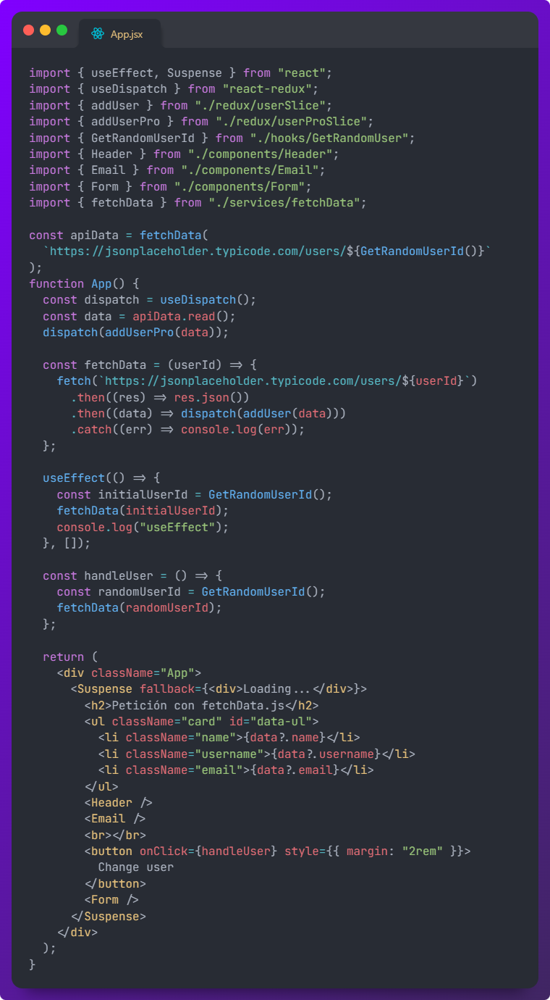
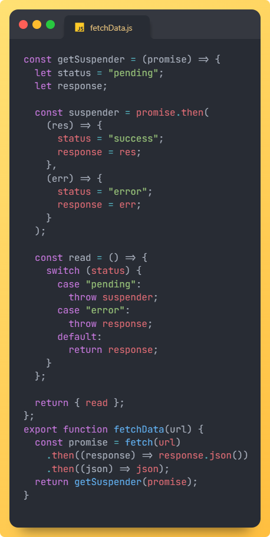

# Render as You Fetch

## FetchPro + Redux

La aplicación se _re-renderizará_ una vez que se hayan obtenido los datos utilizando `Suspense`. Además, la solicitud se realiza fuera del componente y también fuera de cualquier hook `useEffect` para evitar renderizaciones innecesarias, como las conocidas tradicionalmente.

- Se logró combinar satisfactoriamente la petición fetchPro con Redux.
- Componente Form que controla los valores de los datos realizados con la petición fetchData.

Se define la constante apiData, que almacena el resultado de la función fetchData al hacer una solicitud a la API, seguida de un ID de usuario obtenido mediante la función GetRandomUserId(). Se utiliza Redux para el estado global, ya que hace uso de useDispatch para despachar acciones y actualizar el estado de la aplicación.

La función handleUser se utiliza para cambiar el usuario actual llamando a la función fetchData con un nuevo ID de usuario aleatorio. Se utiliza la etiqueta <Suspense> de React para manejar la suspensión mientras se espera la carga de datos. Se muestra un mensaje de carga

---

La función getSuspender toma una promesa como argumento y devuelve un objeto con un método llamado read. Internamente, la función getSuspender crea una variable status inicializada como "pending" y otra variable response que almacena la respuesta de la promesa. La promesa pasada como argumento se resuelve, y dependiendo de si la resolución fue exitosa o resultó en un error, se actualizan las variables status y response en consecuencia.

El método read verifica el estado actual (status) y, en función de ello, lanza una excepción si el estado es "pending" o "error". Si el estado es diferente de "pending" y "error", devuelve la respuesta almacenada.

La función fetchData utiliza la función fetch para realizar una solicitud a la URL proporcionada. Luego, convierte la respuesta en formato JSON y devuelve un objeto obtenido mediante la función getSuspender, que encapsula la promesa de la solicitud.

Este código proporciona una manera de suspender la ejecución hasta que la promesa de la solicitud fetch se resuelva, y luego permite leer la respuesta de la promesa con el método read, teniendo en cuenta los posibles estados de la promesa (pendiente, éxito o error).
